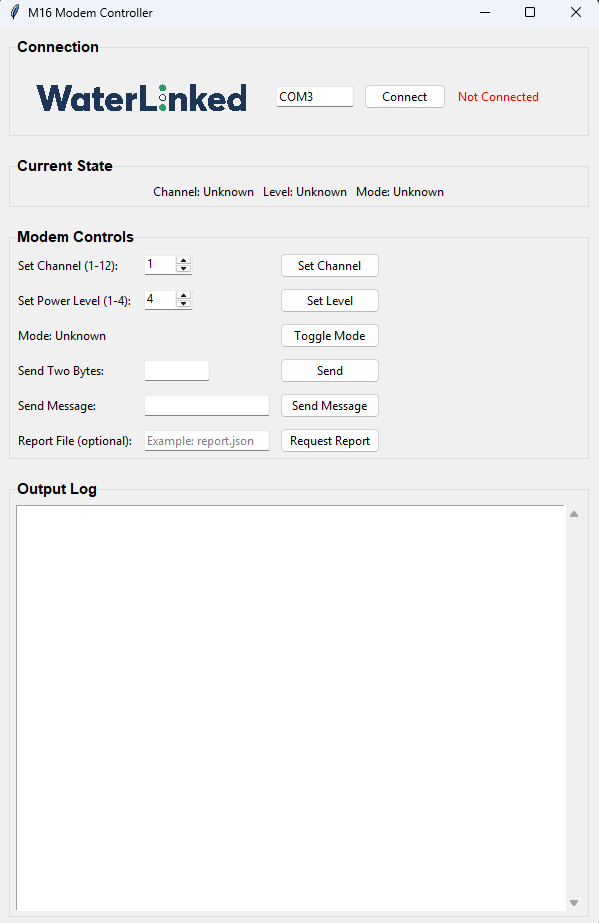
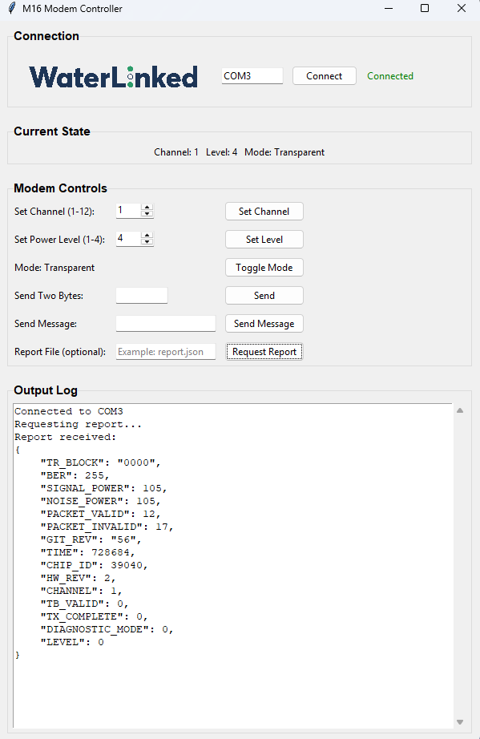
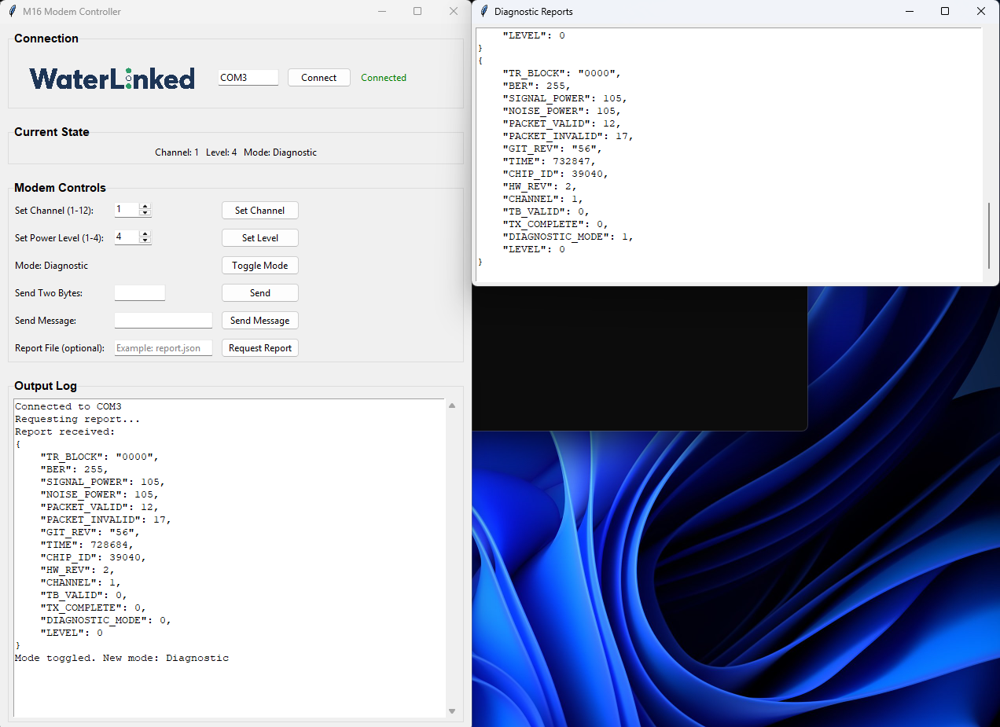

# Water Linked Modem-M16-Driver

## About
This repository includes a simple app to interact with the modem, a driver for easy communication with the modem,
an example report and two example scripts for sending and recieving messages through the modems. For more detailed
information about the M16 modem and its interface, please visit the [official documentaion](https://docs.waterlinked.com/modem-m16/modem-m16/).

### App.exe
This executable facilitates easy verification of the working of the modem, it also hilights some features of the modem
and is a good starting point to get to know the functionality of the modem without Python. The app is a tkinter app that communicates with the modem through `m16_driver.py`.

The default port is set to ``COM3``, the user may need to change this to the apropriate port.

### m16_driver.py
A driver for simple interaction with the modem, it includes functionality for changing of modes, channels and levels.
It also includes functionality for sending 2 bytes and longer messages as well as requesting and saving reports.


### examples.py
Simple script for requesting a report and sending a 2 bytes long message.

### recieve.py
example script for continously listening to the modem.

### report.json
This is an example file that shows what a report decoded with the `M16.decode_packet()`from the modem looks like, saved to a .json file

## Requirements
- [Python3](https://www.python.org/downloads/)
- [pip](https://pip.pypa.io/en/stable/installation/)
- [venv](/https://docs.python.org/3/library/venv.html)
- [requirements.txt](requirements.txt)

## Installation
The driver and app has been developed with python3.10. In order to run the scripts Python must be installed, this can 
either be done with the link in the Recuirements section or from the windows store. venv is standard in Pyhton3.10 on Windows but on linux the user may have to install it, that can be done with the command:

```
sudo apt update
sudo apt install python3 python3-venv
```


To be able to run the code this repository has to be cloned that can either be done throughthe terminal , GitHub CLI or 
by downloading the ZIP file and extracting it to your desired location. The next step is to navigate to the repository 
on your machine, this can be done with the command below:

```
git clone https://github.com/waterlinked/Modem-M16-Driver.git
cd Modem-M16-Driver
```

Next we need to create a virutal environment, the easiest way is from the terminal. On Windows this can be done by 
pressing the ``Windows key`` and searching for ``terminal``. On linux it can be done by pressing ``ctrl + alt + t``. 
In the terminal run the command:

```
python3 -m venv venv
```

Next we need to activate the environment, in powershell on Windows the command is:
```
.\venv\Scripts\Activate.ps1   
```
On linux use this command:
```bash
source venv/Scripts/activate
```

Finally, when the virtual environment is activated install the dependencies with the command:\
(It is activated when <span style="color:lightgreen"> (venv)</span> appears before the terminal path)
```
pip install -r requirements.txt
```

After this the python scripts can be run with the command `python <example_script.py>`

## Screenshot

Screenshot of the app before connecting to the modem\
\
Screenshot of the app after connecting to the modem and requesting a report.\
\
Screenshot of the app while connected and in diagnostic mode\



<!-- Python driver for the Water Linked M16 modem.

This repository includes a library to facilitate communication with the Modem-M16, Simple executable for interacting
with the modem on windows systems and two python files for sending and recieving messages. -->
